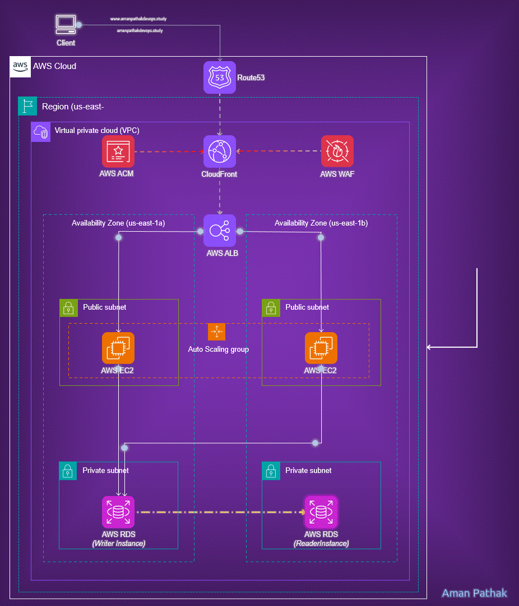

AWS TWO-TIER-ARCHITECTURE
===

## 🏠 Architecture

<!-- BEGIN_TF_DOCS -->
## Requirements

| Name | Version |
|------|---------|
|  [terraform](#requirement\_terraform) | >= 0.14.11 |
|  [aws](#requirement\_aws) | 5.19.0 |
|  [local](#requirement\_local) | 2.4.0 |
|  [random](#requirement\_random) | 3.5.1 |
|  [tls](#requirement\_tls) | 4.0.1 |

## Providers

| Name | Version |
|------|---------|
|  [aws](#provider\_aws) | 5.19.0 |
|  [http](#provider\_http) | 3.4.2 |

## Modules

| Name | Source | Version |
|------|--------|---------|
|  [alb](#module\_alb) | git::ssh://yurii-furko@bitbucket.org/yuriyfRnD/tf-aws-load-balancer.git | master |
|  [data](#module\_data) | git::ssh://yurii-furko@bitbucket.org/yuriyfRnD/tf-aws-data-sources.git | master |
|  [ec2](#module\_ec2) | git::ssh://yurii-furko@bitbucket.org/yuriyfRnD/tf-aws-ec2-service.git | master |
|  [frontent\_security\_group](#module\_frontent\_security\_group) | git::ssh://yurii-furko@bitbucket.org/yuriyfRnD/tf-aws-security-group.git | master |
|  [vpc](#module\_vpc) | git::ssh://yurii-furko@bitbucket.org/yuriyfRnD/tf-aws-vpc-network.git | v1.0.1 |

## Resources

| Name | Type |
|------|------|
| [aws_availability_zones.available](https://registry.terraform.io/providers/hashicorp/aws/5.19.0/docs/data-sources/availability_zones) | data source |
| [aws_caller_identity.current](https://registry.terraform.io/providers/hashicorp/aws/5.19.0/docs/data-sources/caller_identity) | data source |
| [aws_region.current](https://registry.terraform.io/providers/hashicorp/aws/5.19.0/docs/data-sources/region) | data source |
| [aws_route53_zone.main](https://registry.terraform.io/providers/hashicorp/aws/5.19.0/docs/data-sources/route53_zone) | data source |
| [http_http.myip](https://registry.terraform.io/providers/hashicorp/http/latest/docs/data-sources/http) | data source |

## Inputs

No inputs.

## Outputs

No outputs.
<!-- END_TF_DOCS -->