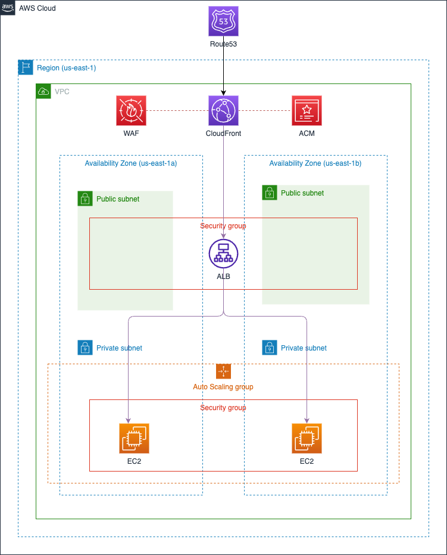

AWS TWO-TIER-ARCHITECTURE
===

[](https://dashboard.infracost.io/org/yuriifurko/repos/c2bc1327-c4d7-485f-9c38-3e7312dfcb7d?tab=settings)

## 🏠 Architecture



### Infracost

[Sample](https://bitbucket.org/infracost/infracost-bitbucket-pipeline/src/master/)

```bash
# generate
infracost generate config --repo-path=. --template-path=infracost.yml.tmpl --out-file=infracost.yml

# breakdown
infracost breakdown --path . --usage-file=infracost.yml
infracost breakdown --config-file=infracost.yml --format=table --out-file=infracost-base.table
```

### Terraform Cloud

[Configuring Bitbucket Cloud Access](https://developer.hashicorp.com/terraform/cloud-docs/vcs/bitbucket-cloud)

### [Associating an email with your GPG key](https://docs.github.com/en/authentication/managing-commit-signature-verification/associating-an-email-with-your-gpg-key)

```bash
export GPG_TTY=$(tty)
gpg --list-secret-keys --keyid-format=long

git config --global commit.gpgsign true
git config --global gpg.program gpg
git config --global user.signingkey <KEY_ID>

# export
gpg --armor --export <KEY_ID>
```

<!-- BEGIN_TF_DOCS -->
## Requirements

| Name | Version |
|------|---------|
| <a name="requirement_terraform"></a> [terraform](#requirement\_terraform) | 1.8.0 |
| <a name="requirement_aws"></a> [aws](#requirement\_aws) | 5.45.0 |
| <a name="requirement_http"></a> [http](#requirement\_http) | 3.4.2 |
| <a name="requirement_local"></a> [local](#requirement\_local) | 2.5.1 |
| <a name="requirement_random"></a> [random](#requirement\_random) | 3.6.0 |
| <a name="requirement_tls"></a> [tls](#requirement\_tls) | 4.0.5 |

## Providers

| Name | Version |
|------|---------|
| <a name="provider_aws"></a> [aws](#provider\_aws) | 5.45.0 |
| <a name="provider_http"></a> [http](#provider\_http) | 3.4.2 |

## Modules

| Name | Source | Version |
|------|--------|---------|
| <a name="module_alb"></a> [alb](#module\_alb) | git::ssh://yurii-furko@bitbucket.org/yuriyfRnD/tf-aws-load-balancer.git | v1.0.0 |
| <a name="module_data"></a> [data](#module\_data) | git::ssh://yurii-furko@bitbucket.org/yuriyfRnD/tf-aws-data-sources.git | v1.0.0 |
| <a name="module_ec2"></a> [ec2](#module\_ec2) | git::ssh://yurii-furko@bitbucket.org/yuriyfRnD/tf-aws-ec2-service.git | v1.0.0 |
| <a name="module_frontent_security_group"></a> [frontent\_security\_group](#module\_frontent\_security\_group) | git::ssh://yurii-furko@bitbucket.org/yuriyfRnD/tf-aws-security-group.git | v1.0.0 |
| <a name="module_route53"></a> [route53](#module\_route53) | git::ssh://yurii-furko@bitbucket.org/yuriyfRnD/tf-aws-route53-records.git | v1.0.0 |
| <a name="module_vpc"></a> [vpc](#module\_vpc) | git::ssh://yurii-furko@bitbucket.org/yuriyfRnD/tf-aws-vpc-network.git | v1.0.1 |

## Resources

| Name | Type |
|------|------|
| [aws_availability_zones.available](https://registry.terraform.io/providers/hashicorp/aws/5.45.0/docs/data-sources/availability_zones) | data source |
| [aws_route53_zone.main](https://registry.terraform.io/providers/hashicorp/aws/5.45.0/docs/data-sources/route53_zone) | data source |
| [http_http.myip](https://registry.terraform.io/providers/hashicorp/http/3.4.2/docs/data-sources/http) | data source |

## Inputs

| Name | Description | Type | Default | Required |
|------|-------------|------|---------|:--------:|
| <a name="input_instance_type"></a> [instance\_type](#input\_instance\_type) | n/a | `string` | `null` | no |

## Outputs

No outputs.
<!-- END_TF_DOCS -->
